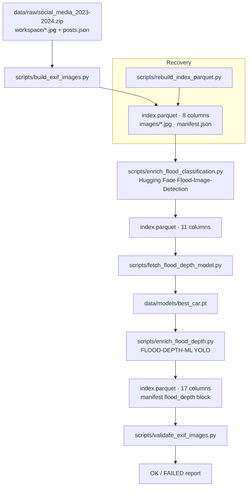
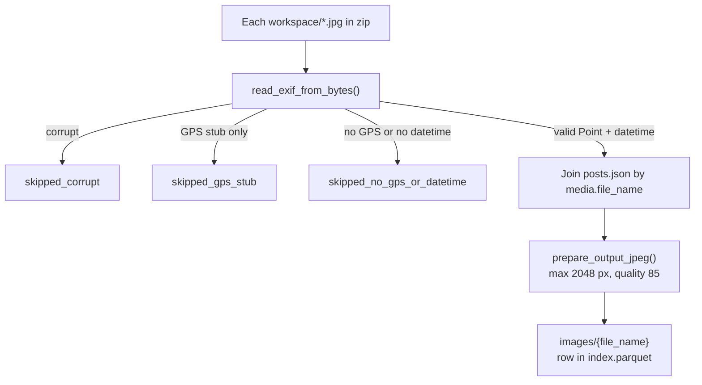
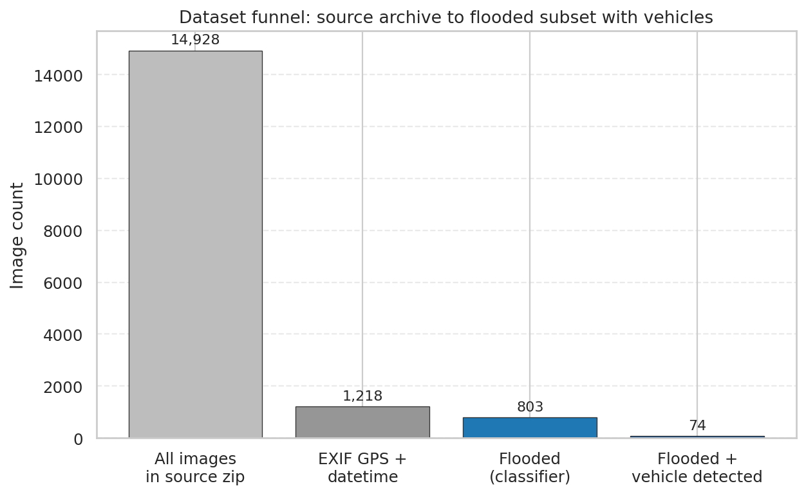
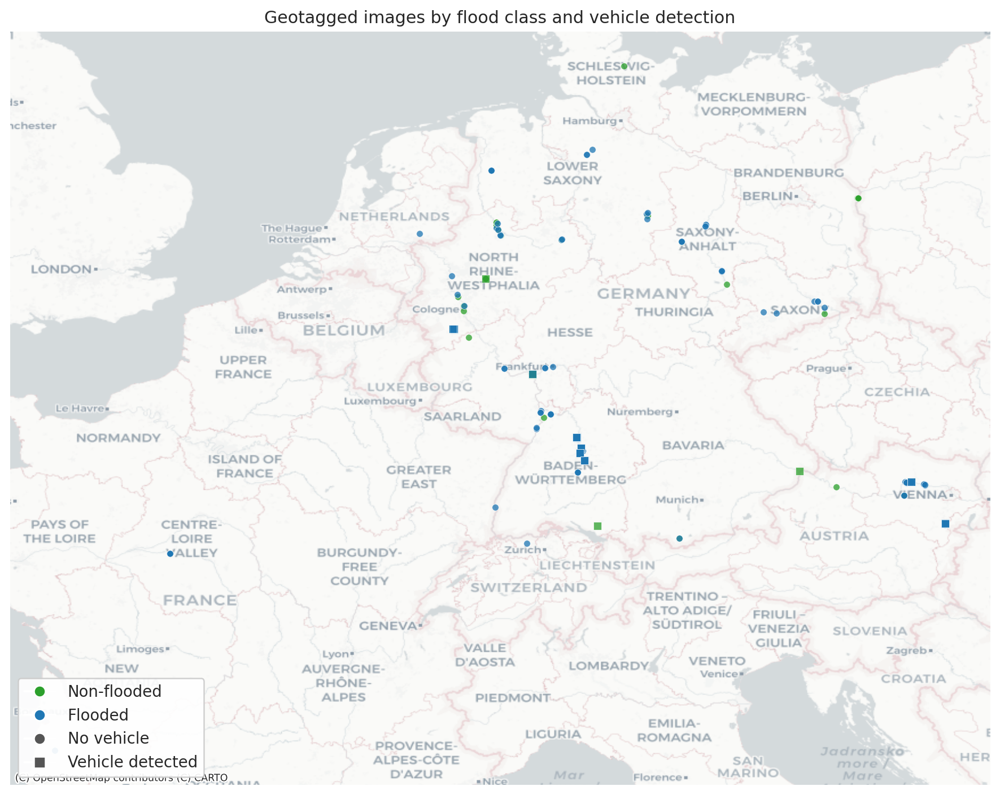
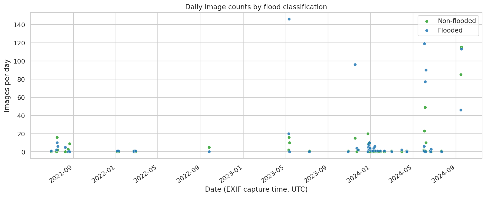
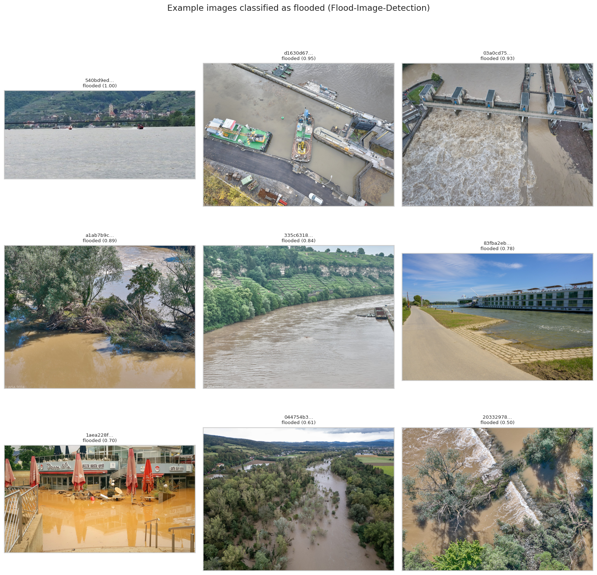
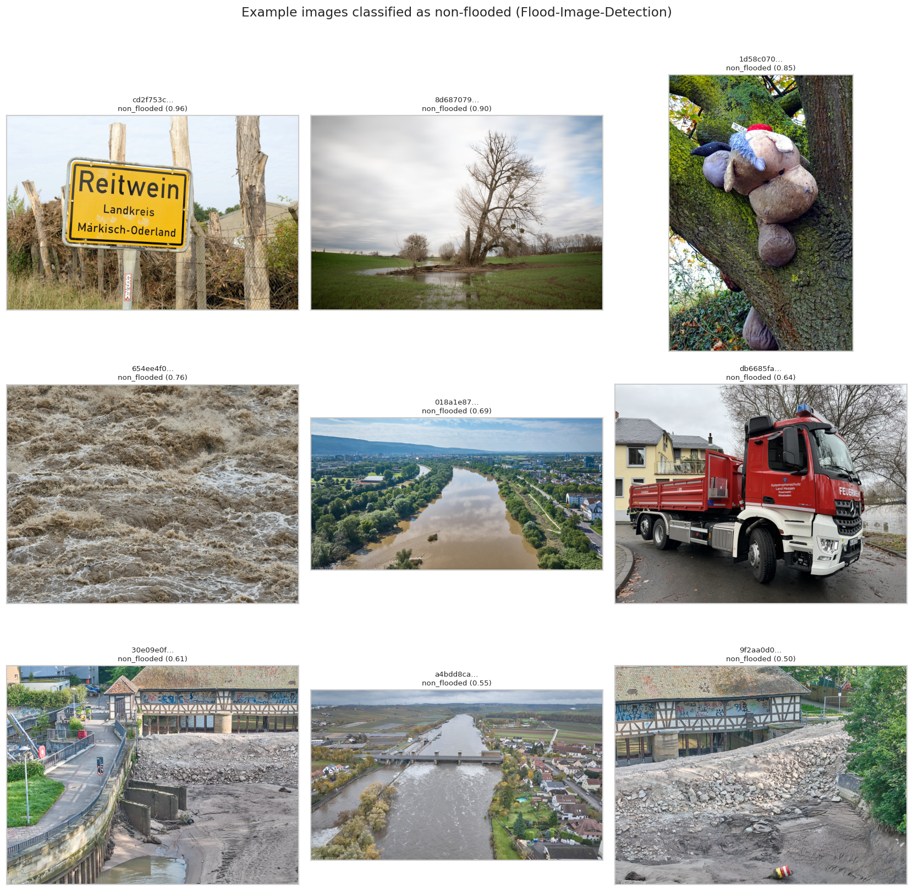
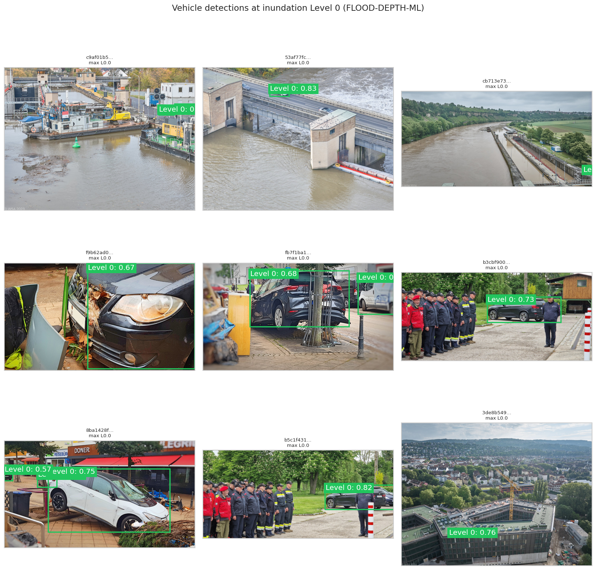
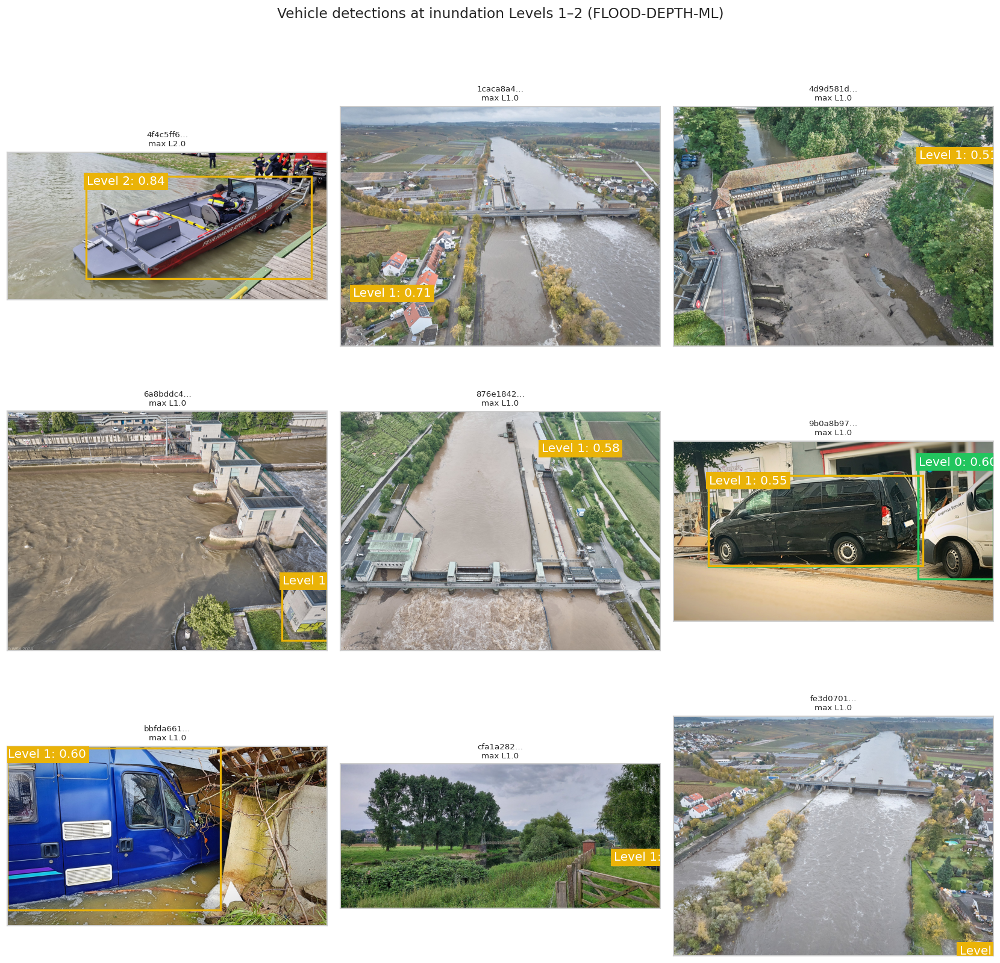
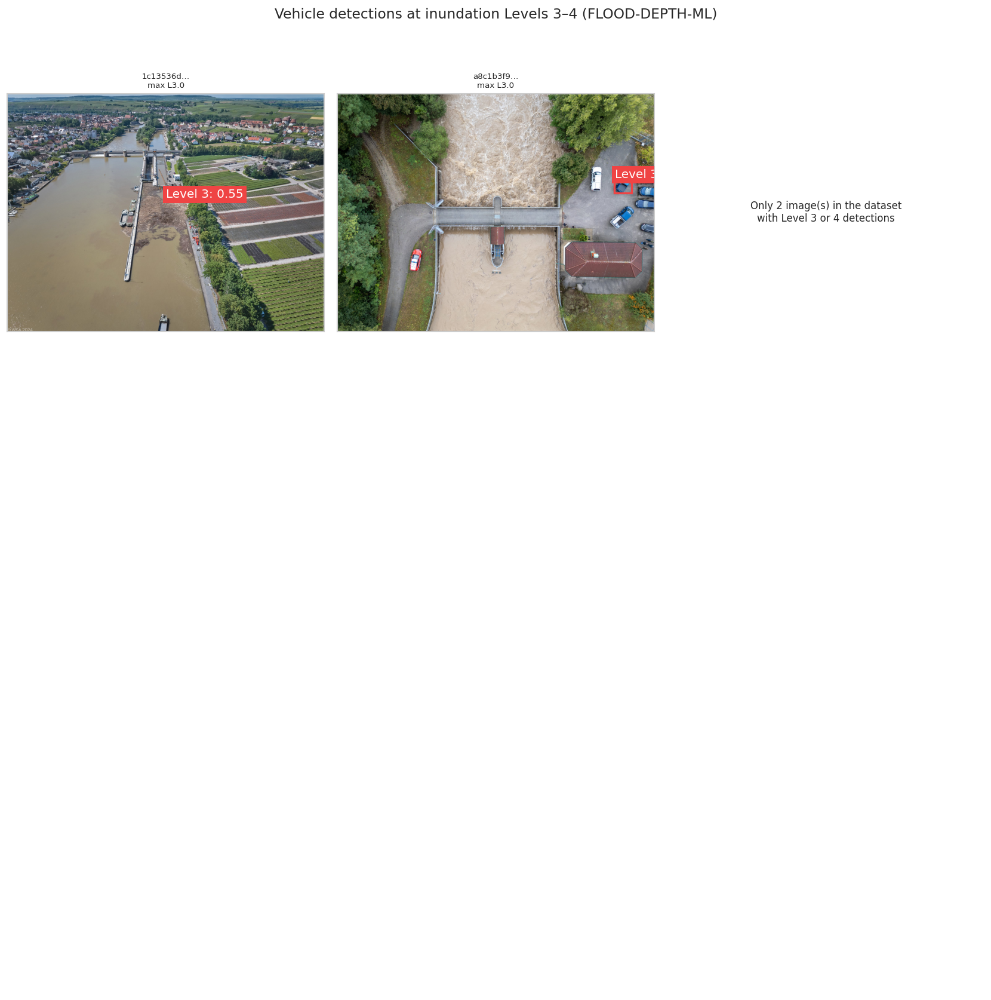

# EXIF images dataset

Portable, geotagged image subset derived from the GIA GigaMove archive `social_media_2023-2024.zip`, with optional machine-learning enrichments for flood scene classification and vehicle inundation depth. This document covers **ingest, build, enrichment, validation, and on-disk layout** only (not the HWC canonical catalogue or the EXIF map web app).

**Source archive:** `data/raw/social_media_2023-2024.zip` (~53 GB) — 14,928 JPEGs plus embedded `workspace/posts.json` ([RAW_DATA.md](RAW_DATA.md#social_media_2023-2024zip)).

**Derived dataset:** `data/exif_images/` — built by streaming the zip (no full extract required).

---

## Summary statistics

Counts below reflect the dataset built on **2026-05-27** (see `data/exif_images/manifest.json`).

| Metric | Count |
|--------|------:|
| Images in source zip | 14,928 |
| Included (EXIF GPS + datetime) | 1,218 |
| Classified as flooded | 803 |
| Classified as non-flooded | 415 |
| Flooded with ≥1 vehicle detected | 74 |
| Any included image with vehicle detected | 123 |

---

## Build pipeline

Run steps in order from the repository root (Python 3.11+ recommended):

```bash
python3 -m venv .venv && .venv/bin/pip install -r requirements.txt
.venv/bin/python scripts/build_exif_images.py
.venv/bin/python scripts/enrich_flood_classification.py
.venv/bin/python scripts/fetch_flood_depth_model.py
.venv/bin/python scripts/enrich_flood_depth.py
.venv/bin/python scripts/validate_exif_images.py
```

**Figure 1 — End-to-end build and enrichment pipeline.** Sequential stages from GigaMove zip to validated Parquet index; flood depth requires classification and downloaded YOLO weights.



**Figure 2 — Inclusion decision at build time.** Only JPEGs that pass EXIF checks are written to `data/exif_images/`; all others are counted in `manifest.json` skip statistics.



---

## Repository layout

**Figure 3 — Files and directories for the EXIF images workflow.** Python package `exif_images/` holds shared logic; `scripts/` are CLI entry points; artefacts live under `data/`.

```text
social_media_data_catalogue/
├── data/
│   ├── raw/
│   │   └── social_media_2023-2024.zip      # source (not modified by build)
│   ├── models/
│   │   └── best_car.pt                     # YOLO weights (gitignored; fetch script)
│   └── exif_images/                        # derived dataset (Figure 4–6)
│       ├── manifest.json
│       ├── index.parquet
│       └── images/
│           └── <uuid>.jpg
├── exif_images/                            # importable library
│   ├── exif.py                             # GPS/datetime parse, column names
│   ├── metadata.py                         # posts.json join
│   ├── resize.py                           # re-encode pipeline
│   ├── flood_classification.py           # SigLIP classifier
│   ├── flood_depth.py                      # YOLO vehicle levels
│   ├── detection_overlay.py                # bbox draw (matches web app)
│   └── paths.py
├── scripts/
│   ├── build_exif_images.py
│   ├── enrich_flood_classification.py
│   ├── fetch_flood_depth_model.py
│   ├── enrich_flood_depth.py
│   ├── validate_exif_images.py
│   ├── rebuild_index_parquet.py
│   └── generate_exif_dataset_doc_figures.py
└── docs/
    ├── EXIF_IMAGES_DATASET.md              # this file
    └── exif_images/figures/
        ├── fig04_dataset_funnel.png
        ├── fig05_spatial_distribution.png
        ├── fig06_daily_timeline.png
        ├── fig09_examples_flooded.png
        ├── fig10_examples_non_flooded.png
        ├── fig11_examples_level_0.png
        ├── fig12_examples_level_1_2.png
        ├── fig13_examples_level_3_4.png
        └── dataset_stats.json
```

---

## On-disk dataset layout

**Figure 4 — Derived dataset directory (`data/exif_images/`).** One row per included JPEG; geometry and ML fields live in Parquet only.

```text
data/exif_images/
├── manifest.json       # provenance, filters, build/enrichment stats
├── index.parquet       # tabular index (8 / 11 / 17 columns by stage)
└── images/
    └── <file_name>.jpg # re-encoded JPEGs; basename matches index.file_name
```

---

## `index.parquet` schema

**Figure 5 — Column groups added at each enrichment stage.**


### Base columns (after `build_exif_images.py`)

| Column | Type | Description |
|--------|------|-------------|
| `file_name` | string | JPEG basename (UUID + `.jpg`) |
| `platform` | string | From joined GIA post (`flickr`, `bluesky`, …) |
| `post_id` | string | Platform post id |
| `caption` | string | Post caption |
| `tags` | string | JSON-encoded tag array |
| `exif_taken_at_original` | timestamp (UTC) | `DateTimeOriginal` if present |
| `exif_taken_at_record` | timestamp (UTC) | `DateTime` if present |
| `geometry` | string | GeoJSON `Point` `[lon, lat]` from EXIF GPS |

### Flood classification columns

| Column | Type | Description |
|--------|------|-------------|
| `flood_class` | string | `flooded` or `non_flooded` (argmax of scores) |
| `flood_score_flooded` | float | Model score for flooded class |
| `flood_score_non_flooded` | float | Model score for non-flooded class |

### Flood depth columns

| Column | Type | Description |
|--------|------|-------------|
| `flood_depth_max_level` | int8 | Max vehicle inundation level 0–4 in frame; `null` if no vehicles |
| `flood_depth_vehicle_count` | int32 | Number of vehicle detections |
| `flood_depth_high_danger` | bool | `true` if any detection at level 3 or 4 |
| `flood_depth_detections` | string | JSON array of `{level, confidence, bbox}` |

**Inundation levels (FLOOD-DEPTH-ML):** ordinal visual proxy from detected vehicles, **not** hydraulic water depth. See [Mayank et al., FLOOD-DEPTH-ML](https://github.com/mayankmi/FLOOD-DEPTH-ML).

---

## `manifest.json`

Machine-readable provenance written/updated by each script:

| Block | When present | Contents |
|-------|----------------|----------|
| (root) | After build | `included_count`, skip counters, `image_processing`, `filter`, `index_columns` |
| `flood_classification` | After classification | `model_id`, `enriched_at`, `device`, `batch_size`, `row_count` |
| `flood_depth` | After depth | `model_path`, `model_source`, `conf_threshold`, `images_with_vehicles`, `images_high_danger` |

Example skip counts from the reference build:

| Counter | Value | Meaning |
|---------|------:|---------|
| `zip_jpg_total` | 14,928 | JPEG members under `workspace/` |
| `included_count` | 1,218 | Written to dataset |
| `skipped_no_gps_or_datetime` | 13,133 | No usable GPS point and/or datetime |
| `skipped_gps_stub` | 304 | GPS IFD present but not a parseable point |
| `skipped_corrupt` | 273 | Unreadable JPEG |

---

## Models and methods

### Flood scene classification

- **Model:** [prithivMLmods/Flood-Image-Detection](https://huggingface.co/prithivMLmods/Flood-Image-Detection) on Hugging Face (SigLIP image classification).
- **Script:** `scripts/enrich_flood_classification.py` → `exif_images/flood_classification.py`.
- **Question answered:** Does the image depict a flooded scene?
- **Output:** `flood_class` plus calibrated-style scores in `[0, 1]`.
- **Citation:** Model card and authors as listed on Hugging Face; use for exploratory labelling, not operational flood mapping without independent validation.

### Flood depth (vehicle inundation proxy)

- **Model:** YOLO weights `best_car.pt` from [FLOOD-DEPTH-ML](https://github.com/mayankmi/FLOOD-DEPTH-ML) (Mayank et al.).
- **Script:** `scripts/fetch_flood_depth_model.py` (download), `scripts/enrich_flood_depth.py` → `exif_images/flood_depth.py` (Ultralytics inference, default `conf=0.5`).
- **Question answered:** Among detected vehicles, what inundation level does the model assign (0–4)?
- **Output:** Per-image aggregates and bounding boxes in `flood_depth_detections`.
- **Visual QA:** Example overlays in Figures 11–13 use the same colours and label format as the map viewer side panel.
- **Citation:** [https://github.com/mayankmi/FLOOD-DEPTH-ML](https://github.com/mayankmi/FLOOD-DEPTH-ML) — vehicle-based visual proxy, not surveyed water stage.

---

## Dataset overview figures

The following embedded figures summarize dataset composition, spatial coverage, and temporal distribution.



**Figure 6.** Bar chart comparing (1) all JPEGs in the source zip, (2) images with parseable EXIF GPS and at least one datetime, (3) images classified as flooded by Flood-Image-Detection, and (4) flooded images with at least one vehicle detected by FLOOD-DEPTH-ML.



**Figure 7.** Map of included images on a light CartoDB Positron basemap ([OpenStreetMap](https://www.openstreetmap.org/copyright) contributors). **Green** (`#2ca02c`): non-flooded; **blue** (`#1f77b4`): flooded. **Circles:** no vehicle detected; **squares:** ≥1 vehicle. Coordinates from EXIF GPS embedded in each JPEG.



**Figure 8.** Scatter points per calendar day (UTC) from EXIF capture time (`exif_taken_at_original`, else `exif_taken_at_record`), coloured by `flood_class`.

---

## Example images

Nine sample thumbnails per panel (3×3 grid), chosen by evenly spacing rows sorted by model score (flooded / non-flooded) or max inundation level (depth panels).

**Bounding-box style (Figures 11–13):** Matches the EXIF map side panel (`web/exif-map/src/components/ImageWithDetections.tsx`): coloured rectangle per vehicle, label `Level {n}: {confidence}` with level-coloured background and white text. Colours from `inundationLevelHex` — L0 `#22c55e`, L1–L2 `#eab308`, L3–L4 `#ef4444` ([`floodDepth.ts`](../web/exif-map/src/lib/floodDepth.ts)). Drawing logic lives in `exif_images/detection_overlay.py`.

| Figure | Panel | Selection rule | Overlays |
|--------|--------|----------------|----------|
| 9 | Flooded | `flood_class == flooded`, sorted by `flood_score_flooded` | None |
| 10 | Non-flooded | `flood_class == non_flooded`, sorted by `flood_score_non_flooded` | None |
| 11 | Level 0 | `flood_depth_max_level == 0` | All detections |
| 12 | Levels 1–2 | `flood_depth_max_level` in {1, 2} | All detections |
| 13 | Levels 3–4 | Any detection at level 3 or 4 | All detections |



**Figure 9.** Nine images classified as **flooded** by [Flood-Image-Detection](https://huggingface.co/prithivMLmods/Flood-Image-Detection). Subtitle: class and flooded score.



**Figure 10.** Nine images classified as **non-flooded**. Subtitle: class and non-flooded score.



**Figure 11.** Images whose highest vehicle inundation level is **0** ([FLOOD-DEPTH-ML](https://github.com/mayankmi/FLOOD-DEPTH-ML)); boxes and labels drawn from stored `flood_depth_detections`.



**Figure 12.** Images with max inundation level **1 or 2**; box colours yellow (`#eab308`).



**Figure 13.** Images with at least one **Level 3 or 4** detection (high-danger proxy); box colours red (`#ef4444`). The reference build contains only **two** such images, so remaining grid cells are left empty.

---

## Validation

`scripts/validate_exif_images.py` checks:

- Parquet column set matches `manifest.json` enrichment stage
- Bijection between `images/*.jpg` and `index.parquet` rows
- GeoJSON points, datetime fields, max edge ≤ `max_dimension_px`
- Re-read EXIF from disk JPEGs matches stored geometry and timestamps
- Flood scores in range; `flood_class` consistent with score argmax
- Depth JSON consistent with counts, levels, bboxes inside image bounds

Smoke-test a subset: `validate_exif_images.py --sample 50`.

---

## Operational notes

- **Disk:** Building writes ~1.2k re-encoded JPEGs plus Parquet; classification downloads Hugging Face weights on first run. Set `HF_HOME` to a volume with free space if needed.
- **Overwrite:** `build_exif_images.py --overwrite` replaces an existing dataset directory.
- **Missing Parquet:** If `images/` is intact but `index.parquet` is missing, run `rebuild_index_parquet.py`, then re-run enrichment scripts.
- **Not ground truth:** ML labels support exploration and QA; confirm critical cases manually before operational use.

---

## References

1. GIA / RWTH GigaMove export `social_media_2023-2024.zip` — see [RAW_DATA.md](RAW_DATA.md).
2. **Flood-Image-Detection:** Prithiv ML Mods. *Flood-Image-Detection* [model]. Hugging Face. https://huggingface.co/prithivMLmods/Flood-Image-Detection
3. **FLOOD-DEPTH-ML:** Mayank, M. et al. *FLOOD-DEPTH-ML* [software]. GitHub. https://github.com/mayankmi/FLOOD-DEPTH-ML — weights file `best_car.pt`.
4. **Basemap tiles (Figure 7):** CARTO Positron via [Contextily](https://contextily.readthedocs.io/) / [OpenMapTiles](https://openmaptiles.org/) — © [OpenStreetMap](https://www.openstreetmap.org/copyright) contributors, © CARTO.

---

## Related documentation

| Document | Scope |
|----------|--------|
| [RAW_DATA.md](RAW_DATA.md) | GigaMove raw files and zip layout |
| [README.md](../README.md) | Repository overview (includes map viewer commands) |
