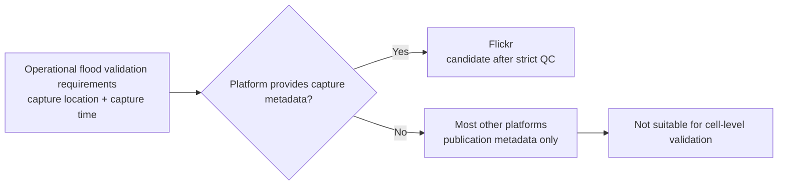
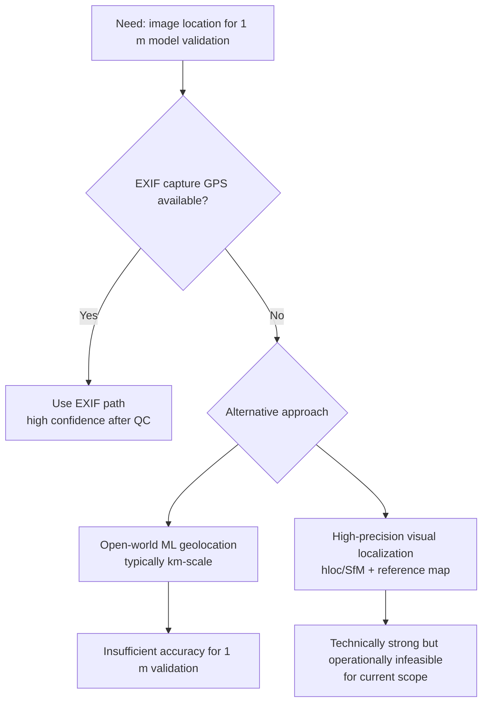
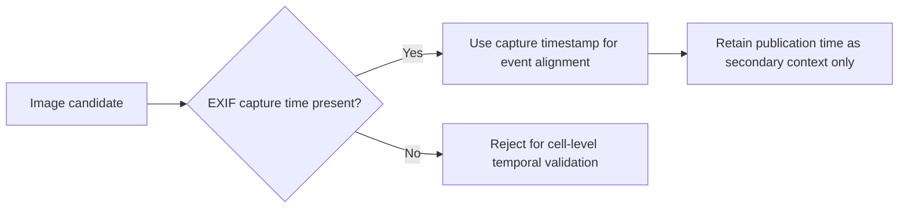
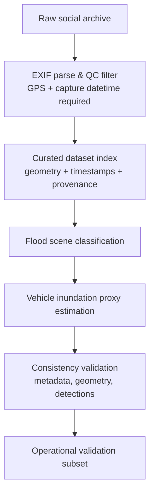

# Operational Usage of Social Media Data for Flood Depth Validation

## Abstract

Validating flood depth simulations at **1 m spatial resolution** requires observations with high confidence in both position and capture time. Social media imagery is attractive because it provides dense, opportunistic street-level evidence during flood events, but most platforms expose publication metadata rather than capture metadata. This mismatch creates a critical operational gap: image-based observations that are useful for communication are often not precise enough for cell-level hydraulic validation.  

This paper evaluates platform metadata reliability, geolocation alternatives, and implementation feasibility in the context of the `social_media_data_catalogue` workflow. The analysis shows that **Flickr is currently the only practical platform for this use case**, because it can expose EXIF-derived GPS and capture time fields through its API, while most other platforms remove EXIF and provide only post-level metadata. We further assess machine-learning-based image geolocation approaches and conclude that open-world methods remain at kilometer scale, while high-precision visual localization stacks require substantial reference mapping infrastructure and are not currently feasible for routine operational deployment in this project.  

Finally, we document the implemented project methodology: strict EXIF filtering, reproducible enrichment, and transparent quality controls. This produces a smaller but defensible validation subset suitable for operational flood model verification workflows.

---

## 1. Introduction

Cellular automata flood models at 1 m resolution can represent highly localized inundation patterns, including curb transitions, street-channel flow paths, and parcel-level exposure. The value of such models depends on robust validation against observations that are co-located in space and synchronized in time.

In principle, social media images could complement sparse in-situ gauge networks by providing distributed visual evidence during and after flood peaks. In practice, operational use is constrained by metadata provenance:

- **Spatial requirement:** observations should map to the correct grid cell or immediate neighborhood.
- **Temporal requirement:** observations should correspond to event time, not delayed posting time.
- **Evidence requirement:** imagery should contain interpretable water-level proxies (e.g., vehicle submergence).

When any of these fail, validation uncertainty dominates and can exceed the model signal at 1 m resolution.

### 1.1 Scope

This document focuses on operational validation workflows using:

- API-accessible social media metadata,
- EXIF-based capture location/time where available,
- and image-based flood-depth proxy estimation from this repository.

It does not claim image-derived inundation labels as surveyed ground truth; rather, it positions them as constrained observational support under explicit uncertainty.

---

## 2. Why Social Media Validation Is Difficult at 1 m Resolution

### 2.1 Capture Metadata vs Publication Metadata

For flood-depth model validation, the relevant fields are:

- **Capture location:** where the camera was when the image was taken.
- **Capture time:** when the image was recorded.

Most social APIs instead provide:

- **Post location:** user-tagged place or coarse geographic context.
- **Post time:** when content was uploaded/published.

This distinction is not cosmetic. A delay of hours can move an observation from rising limb to recession phase; a location offset of hundreds of meters can move it across different flow regimes.

### 2.2 Resolution Mismatch and Error Propagation

At 1 m model resolution, uncertainty sources compound quickly:

- coarse or ambiguous geotags,
- user-edited location tags,
- stripped EXIF,
- unknown temporal lag between capture and upload,
- and content-location ambiguity (photo can be reposted by non-local users).

As a result, many social posts are unsuitable for direct cell-level validation even if they clearly depict flooding.

---

## 3. Platform Metadata Comparison for Operational Flood Validation

The table below summarizes platform suitability based on metadata needed for flood-depth validation.

| Platform | Capture Location | Capture Time | Post Metadata | Operational Suitability |
|---|---|---|---|---|
| **Flickr** | Available via geo endpoints and EXIF access | Separate `date_taken` available | `date_upload` available separately | **High (with filtering)** |
| **Twitter/X** | No EXIF capture GPS in public API | No capture-time field | `created_at`, coarse place context | Low |
| **TikTok** | No capture GPS | No capture-time field | publication time, coarse account-region signals | Low |
| **YouTube** | recording fields exist but sparsely populated and often manual | recording date inconsistently populated | `publishedAt` | Low |
| **Instagram** | EXIF/capture fields unavailable | capture-time unavailable | publish timestamp | Low |
| **Bluesky** | no geolocation fields | no capture-time fields | post timestamp | Low |
| **Snapchat (official APIs)** | no content geodata access | no content capture metadata access | not suitable for this workflow | Low |

**Figure 1 — Platform metadata suitability for flood validation at 1 m.**

**Figure 1.** Decision perspective on platform utility. The core branch condition is whether capture-location and capture-time metadata are available and separable from publication metadata.

### 3.1 Operational Ranking

For this repository and objective, the practical ranking is:

1. **Flickr** (only platform with actionable capture metadata path),
2. all others (insufficient metadata fidelity for 1 m validation under routine API access).

This ranking reflects operational metadata quality, not platform popularity.

---

## 4. Empirical Evidence from the Project Dataset

The current repository pipeline builds an EXIF-qualified subset from the raw social media archive.

**Figure 2.** Funnel from all source JPEGs to images with parseable EXIF GPS and datetime, then to model-enriched subsets. The strong reduction in sample size reflects strict quality filtering required for operational validity.

**Figure 3.** Spatial distribution of included images using EXIF-derived coordinates. This map shows where location evidence is strongest after filtering and where observational support remains sparse.

**Figure 4.** Daily distribution of images using EXIF capture timestamps (`DateTimeOriginal` fallback to `DateTime`) rather than publication timestamps. This is essential for event-phase-consistent validation.

### 4.1 Key Implication

The pipeline demonstrates a structural trade-off:

- **Without strict filtering:** larger sample but weak spatial-temporal reliability.
- **With strict filtering:** smaller sample but defensible validation quality.

For 1 m flood-depth model evaluation, the second option is operationally preferable.

---

## 5. Geolocating Images Without EXIF: Current ML Limits

When EXIF is missing, one could infer location directly from image content. This section compares that option with project requirements.

### 5.1 Open-World Geolocation (GeoGuessr-like)

Modern open-world geolocation systems can infer broad location context, but typical uncertainty remains on kilometer to tens-of-kilometer scales depending on scene distinctiveness. Even strong systems are generally insufficient for meter-scale hydraulic validation.

### 5.2 Why Kilometer-Scale Estimates Are Not Usable Here

At 1 m flood model resolution:

- a 1 km position error spans ~1,000 grid cells in each direction,
- topography, drainage, and flow barriers can vary strongly within that range,
- and expected water depth can change substantially between adjacent neighborhoods.

Therefore, outputs in the “multiple kilometers” range (e.g., Nomad-style estimates) are outside operational usefulness for this purpose.

### 5.3 Advanced Visual Localization Pipelines

High-precision localization approaches (e.g., hierarchical localization / hloc, SfM-based pipelines, feature matching with geometric verification) can achieve meter to sub-meter precision **if** a dense geo-referenced reference map exists and is maintained.

For this project context, these approaches are currently not feasible as routine operational components because they require:

- extensive reference image/3D map infrastructure,
- robust re-localization and drift handling workflows,
- high engineering and maintenance overhead,
- and area-specific calibration that does not transfer cleanly across flood events.

**Figure 5 — Maturity and feasibility of geolocation approaches for this project.**

**Figure 5.** Feasibility logic used in this project. EXIF-first filtering remains the only operationally defensible strategy under current resources and requirements.

---

## 6. Temporal Integrity: Capture Time vs Publish Time

Temporal metadata quality mirrors spatial challenges.

### 6.1 Why Capture Time Matters

Flood depths evolve quickly during peak events. Validation requires timestamp alignment close to the modeled state. Publication timestamps can deviate from capture time by minutes, hours, or longer, depending on connectivity and posting behavior.

### 6.2 Operational Rule Applied in This Project

This workflow prioritizes EXIF capture time fields:

- `exif_taken_at_original` (preferred),
- `exif_taken_at_record` (fallback),
- publication timestamp only as contextual metadata.

**Figure 6 — Temporal decision flow for ingestion and validation.**

**Figure 6.** Temporal filtering policy to avoid phase errors in flood-depth validation.

---

## 7. Implemented Methodology in This Repository

The project operationalizes the above constraints through a reproducible processing chain.

### 7.1 Processing Steps

1. Stream JPEGs from raw archive.
2. Parse EXIF and keep only images with valid GPS point and datetime.
3. Join social post metadata for provenance.
4. Build curated dataset index and normalized images.
5. Enrich with flood-scene classification.
6. Enrich with vehicle-based inundation proxy estimation.
7. Run validation checks on metadata, geometry, and enrichment consistency.

**Figure 7 — Repository implementation flow for operational validation subset creation.**

**Figure 7.** Project-specific operational workflow. The strict QC gate is intentionally early to avoid compounding downstream uncertainty.

### 7.2 Flood-Depth Proxy Interpretation

The flood-depth component uses visual vehicle submergence levels as an ordinal proxy (0–4). It supports comparative interpretation and triage, but it is not a direct hydraulic measurement. The output should therefore be used as constrained evidence, not standalone truth.

---

## 8. Discussion

### 8.1 Main Operational Insight

The bottleneck is not the absence of computer vision models; it is the scarcity of trustworthy capture metadata that can survive legal API access and practical engineering constraints.

### 8.2 Uncertainty and Bias

Even with EXIF-based filtering, residual uncertainties remain:

- manual or edited geotags,
- photographer and platform user bias,
- non-uniform spatial sampling,
- and event-visibility bias (dramatic scenes overrepresented).

These must be acknowledged in model performance interpretation.

### 8.3 Why Flickr Is the Practical Choice

Flickr is the only platform in this comparison that can provide a plausible end-to-end path from API retrieval to capture metadata-based quality control with explicit differentiation between capture and upload timing. This does not eliminate uncertainty, but it enables manageable uncertainty accounting.

---

## 9. Conclusion

For operational flood-depth validation of a **1 m cellular automata model**, social media data is only useful when spatial and temporal provenance is strong enough for cell-level interpretation.

From a platform and implementation perspective:

- **Flickr is currently the only operationally viable source** among major platforms for this purpose.
- **GeoGuessr-like/open-world ML geolocation is not mature enough** for meter-scale validation.
- **High-precision localization frameworks (e.g., hloc-class pipelines)** are technically capable but currently infeasible for routine deployment in this project context.

Accordingly, the implemented repository strategy—strict EXIF-based filtering, capture-time-first temporal handling, and reproducible enrichment/validation—provides the most defensible pathway for operational use.

---

## References

1. `docs/EXIF_IMAGES_DATASET.md` — EXIF dataset construction, schema, enrichment, and validation workflow.
2. `docs/flood_depth_estimation_summary.md` — flood-depth estimation methods and deployment-readiness review.
3. `docs/image_geolocation_overview.md` — geolocation method classes and accuracy regimes.
4. `docs/social_media_api_geo_comparison.md` — platform API comparison for capture/post geolocation and datetime metadata.
5. Prithiv ML Mods. *Flood-Image-Detection*. Hugging Face model repository.
6. Mishra, M. et al. *FLOOD-DEPTH-ML*. GitHub repository.
7. Sarlin, P.-E. et al. *Hierarchical Localization (hloc)*. GitHub repository.
